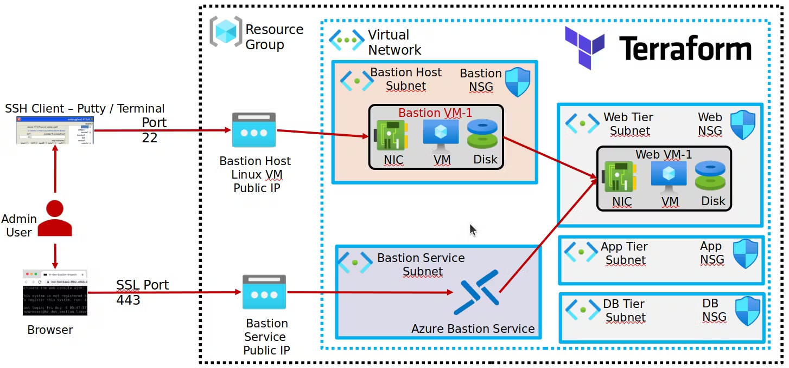
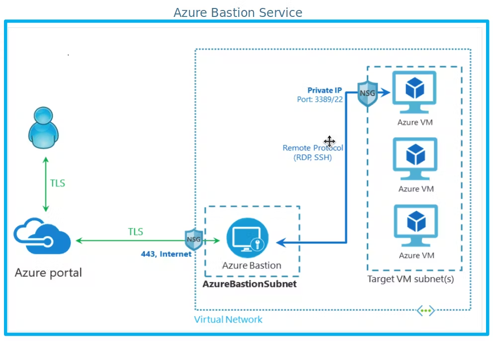
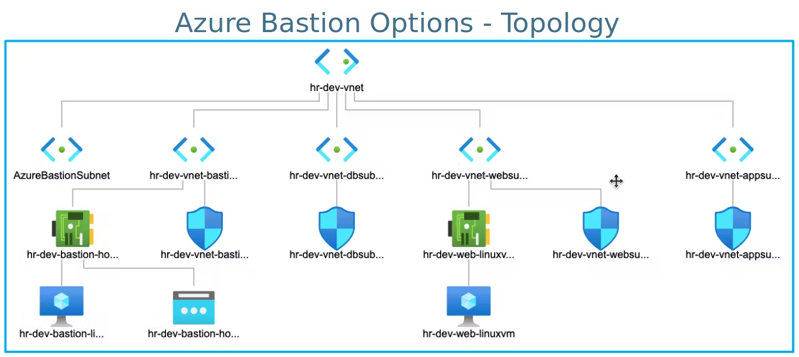

# Azure-Infrastructure-Automation-with-Terraform
## Blog 1: https://rohitexplainstech.hashnode.dev/azure-infrastructure-automation-with-terraform

## Resources to be Created
### Azure Resource Groups
- azurerm_resource_group: This resource group will serve as a container for all the Azure resources.
Networking Components
- azurerm_virtual_network: The virtual network to house all subnets and network interfaces.
- azurerm_subnet: Subnets within the virtual network.
- azurerm_network_security_group: Network Security Groups to manage and control inbound and outbound traffic.
- azurerm_subnet_network_security_group_association: Association of Network Security Groups with specific subnets.
- azurerm_network_security_rule: Security rules to allow or deny specific network traffic.
- azurerm_public_ip: Public IP addresses for external communication.
- azurerm_network_interface: Network interfaces for the virtual machines.
- azurerm_network_interface_security_group_association: Association of Network Security Groups with network interfaces.
  
### Virtual Machines
- azurerm_linux_virtual_machine: Azure Linux Virtual Machines with custom data for initialization.
## Terraform Features and Functions
### Meta-arguments and Blocks
- Terraform Local Block for Security Rule Ports: Definition of local variables to manage security rule ports.
- Terraform for_each Meta-argument: Efficient creation of multiple similar resources using loops.
- Terraform Local Block for Custom Data: Defining custom data scripts to initialize the Azure Linux Virtual Machine.
### Terraform Functions
- file: Reads the contents of a file.
- filebase64: Reads the contents of a file and encodes it to base64.
- base64encode: Encodes a string to base64.
### Outputs
- Terraform Outputs for the created Azure resources, including details like resource IDs, public IP addresses, and network configurations.

-----------------------------------------------------------------------------

## Blog 2: https://rohitexplainstech.hashnode.dev/azure-infrastructure-automation-with-terraform-part-2

.png>)

### Azure Resources to be Created

- Terraform Input Variables

- azurerm_public_ip

- azurerm_network_interface

- azurerm_linux_virtual_machine

- Terraform Null Resource null_resource

- Terraform File Provisioner

- Terraform remote-exec Provisioner

- azurerm_bastion_host

- Azure Bastion Service

- Terraform Output Values

-------------------------------------------------------------------------------

## Blog 3: https://rohitexplainstech.hashnode.dev/azure-infrastructure-automation-with-terraform-part-3

.png>)